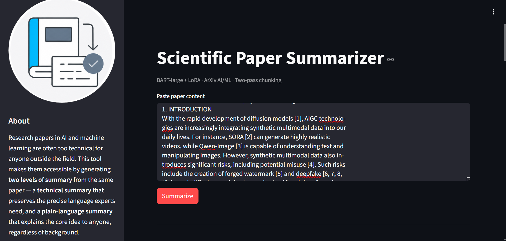
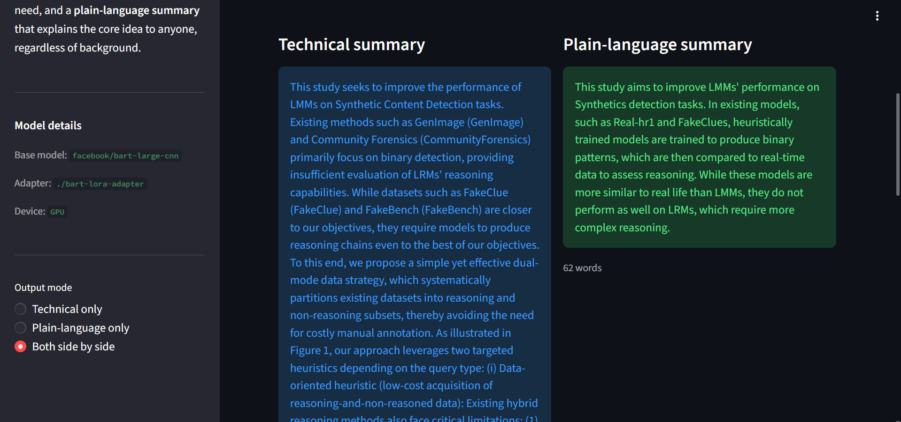
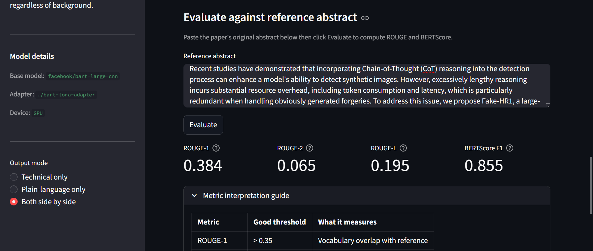

# Domain-Aware_Paper_Summarizer
Domain-aware abstractive summarization of arXiv AI/ML papers using BART-large and LoRA fine-tuning.

## What This Does
Takes a full scientific paper as input and generates either a technical summary 
or a plain-language simplified summary evaluated with BERTScore and 
Flesch-Kincaid readability metrics.

## Key Results
- BERTScore F1:  0.85–0.87 
- A comparable study using Llama-3.1 (8B–70B parameters) on legal documents reported a BERTScore F1 of 0.633; though direct comparison is limited by domain and dataset differences.
- Trained on 2,500 arXiv papers across 5 AI/ML subfields
- Only ~3.2M trainable parameters via LoRA (vs 406M full fine-tune)

## How It Works
1. Raw paper text is cleaned (LaTeX, equations, and citation markers removed)
2. Text is chunked into model-safe segments
3. Pass 1: each chunk is summarized independently
4. Pass 2: chunk summaries are merged and re-summarized into a final output
   

5. Output is delivered in Technical or Simplified mode or both side by side
   

6. Generated Summaries can be evaluated against Reference summary with metrics scores displayed
   

## Files
- `Final_summarizer.ipynb`  full pipeline: preprocessing, training, and inference
- `Streamlit_app.py`  Streamlit web interface
- `fallback_inference.py`  standalone inference script for single-paper testing
- `docs/Final_Summarization_Report.pdf` full project report

## Model & Dataset
- Base model: BART-large (facebook/bart-large-cnn)
- Fine-tuning: LoRA via HuggingFace PEFT
- Dataset: FlameF0X/arXiv-AI-ML (Hugging Face) : 2,500 papers
- Simplification: keep_it_simple (GPT-2 based)

## Requirements
See requirements.txt

## Documentation
Full report available in /docs
